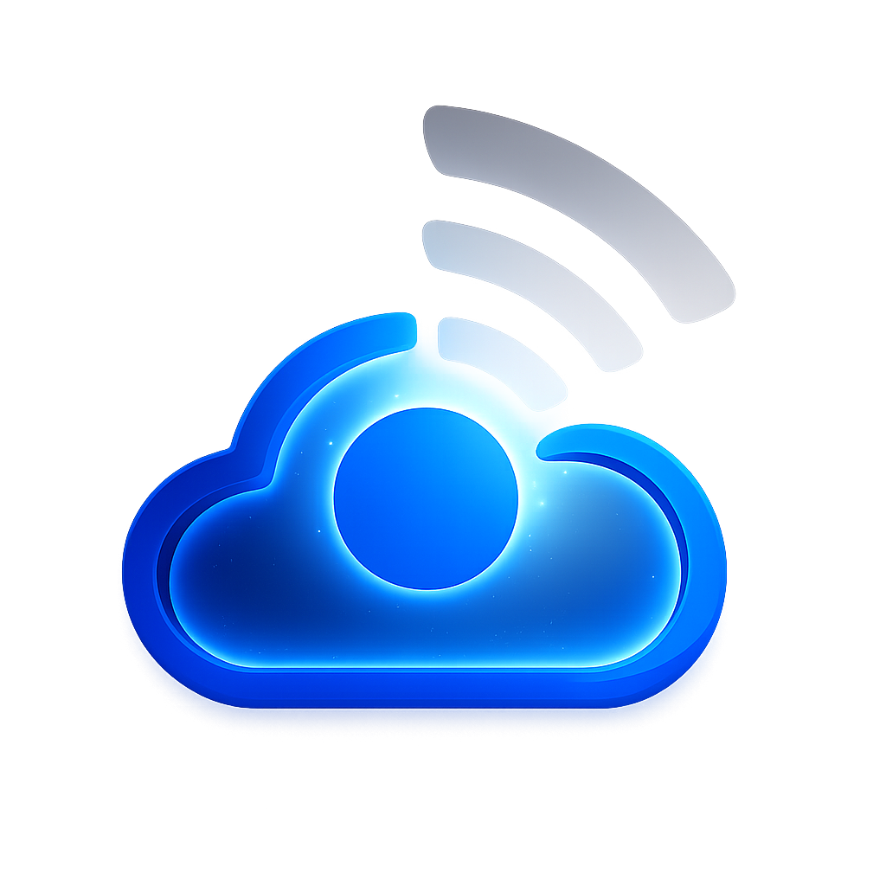

<div align="center">
  
  <h1 style="font-size: 2.5em; margin-top: 20px;">
    📡 WebRTC Online Meeting Platform
  </h1>
</div>

A real-time video chat application using WebRTC, Node.js, and Socket.io for signaling. This project enables peer-to-peer video communication directly in the browser.

---

## 🌟 Features

- 🎥 Real-time video and audio communication
- 🤝 Peer-to-peer connection using WebRTC
- 🔗 Signaling server using Socket.io
- 📱 Responsive design for all devices
- 🔒 Secure connections (when deployed with HTTPS)
- 📦 Simple setup and configuration

---

## 🖥️ Screenshots
 

---

## 🛠️ Prerequisites

Before you begin, ensure you have met the following requirements:

- Node.js (v14 or higher)
- npm (usually comes with Node.js)
- Modern web browser (Chrome, Firefox, Edge, Safari)
- (Optional) SSL certificate for HTTPS (required for production)
  
---

## 🚀 Installation

Follow these steps to install and set up the project:

1. **Clone the repository**
   ```bash
   git clone https://github.com/GimhaniDilmika/PeerMeet-WebRTC.git
   cd PeerMeet-WebRTC-online-meeting-platform
   ```

2. **Install dependencies**
   ```bash
   npm install
   ```

3. **Configure environment variables**

   Create a `.env` file in the root directory:
   ```env
   PORT=5173
   NODE_ENV=development
   # For production, you'll need to add SSL certificate paths
   # SSL_CERT_PATH=/path/to/cert.pem
   # SSL_KEY_PATH=/path/to/key.pem
   ```

---

## � Running the Application

### Development Mode

1. **Start the server**
   ```bash
   npm run dev
   ```

2. **Open in browser**
   - Open two browser tabs/windows at `http://localhost:5173`
   - Allow camera and microphone permissions when prompted
   - Start video chatting between the two tabs

### Production Mode

For production, you'll need HTTPS (WebRTC requires secure contexts):

1. **Build the application**
   ```bash
   npm run build
   ```

2. **Start the production server**
   ```bash
   npm start
   ```

3. **Access via HTTPS**
   - Open your browser at `http://localhost:5173`
     
---

## 🧩 Project Structure

```
PeerMeet-WebRTC/
├── node_modules/ # All npm dependencies
├── public/ # Static assets
│ ├── img/ # Image resources
│ │ └── logo.png # Application logo
│ ├── index.html # Main HTML entry point
│ └── style.css # Global styles
│ └── app.js # Main frontend logic
├── server/ # Backend server
│ └── server.js # Express/Socket.io server
├── package.json # Project metadata and dependencies
├── package-lock.json # Exact dependency tree
└── README.md # Project documentation
```

### Other Platforms

For other platforms (AWS, DigitalOcean, etc.), follow their Node.js deployment guides. Remember to:

- Set up HTTPS
- Configure the correct port
- Set `NODE_ENV=production`
  
---

## 🤝 Contributing

Contributions are welcome! Please follow these steps:

1. Fork the project
2. Create your feature branch (`git checkout -b feature/AmazingFeature`)
3. Commit your changes (`git commit -m 'Add some AmazingFeature'`)
4. Push to the branch (`git push origin feature/AmazingFeature`)
5. Open a Pull Request
   
---


📬 Contact
<p align="center"> <a href="mailto:gimhanidilmika1@gmail.com">  </a> <a href="https://github.com/GimhaniDilmika">  </a> </p>

📫 Email: gimhanidilmika1@gmail.com


---

## 🙏 Acknowledgments

- [WebRTC](https://webrtc.org/) for the amazing real-time communication technology
- [Socket.io](https://socket.io/) for simple signaling
- All open-source libraries used in this project

---

***💡 If you like this project, don't forget to give it a ⭐ on GitHub! 😊***
